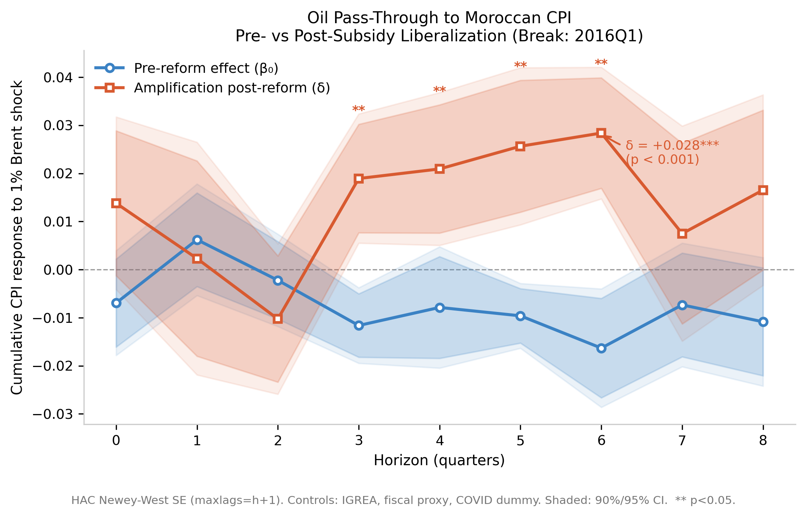

# Oil Price Pass-Through to Moroccan CPI

**Research question:** Did Morocco's 2013–2016 fuel subsidy liberalization amplify the pass-through of global oil price shocks to consumer inflation?

---

## Result

Using Local Projections with a regime-interaction term (T = 71 quarters, 2007Q2–2024Q4):

> **δ(h=6) = +0.028, p < 0.001 (HAC Newey-West)**
>
> A 10% increase in Brent generates a +0.28 pp additional CPI response post-liberalization relative to the pre-reform period. The pre-reform coefficient β₀ is close to zero at all horizons, consistent with the CDC fully absorbing oil price shocks under the subsidy regime.

The result is robust to four alternative break dates (2013Q3, 2014Q1, 2015Q1, 2016Q1).

---

## Main Figure



---

## Data Sources

| Series | Source | Coverage |
|---|---|---|
| Brent crude | FRED `DCOILBRENTEU` | 2000Q2–2024Q4 |
| CPI Morocco | Ha, Kose & Ohnsorge (2021) | 2007Q2–2024Q4 |
| IGREA | Kilian (2009) / FRED | 2000Q1–2024Q4 |
| Current account % GDP | IMF DataMapper | 2000–2024 |
| Fiscal balance % GDP | IMF DataMapper | 2000–2024 |

---

## Methodology

**Model:** Local Projections (Jordà 2005) with subsidy-liberalization regime interaction:

```
CPI_{t+h} − CPI_{t−1} = α + β₀·Δlog(Brent)ₜ + δ·(D_lib × Δlog(Brent))ₜ + γ·D_lib + Γ′Xₜ₋₁ + εₜ,ₕ
```

- Horizons h = 0, ..., 8 quarters
- HAC Newey-West SE with maxlags = h+1
- Break date baseline: 2016Q1 (first full quarter post-liberalization)
- Controls: IGREA, fiscal proxy, COVID dummy, 2 lags of CPI and Brent

---

## Repo Structure

```
wb_morocco_oilpass/
├── data/
│   ├── processed/
│   │   └── master_quarterly_no_fx.csv
│   └── raw/
│       ├── cpi_quarterly.csv
│       ├── igrea_quarterly.csv
│       ├── imf_annual.csv
│       ├── macro_quarterly.csv
│       └── oil_quarterly.csv
├── outputs/
│   ├── figures/
│   │   ├── lp_irf_cpi_overlay.png
│   │   ├── lp_irf_cpi_overlay.pdf
│   │   ├── lp_irf_cpi_main.png
│   │   └── lp_irf_cpi_main.pdf
│   └── tables/
│       ├── lp_results_cpi_2013_Q3_lags2.csv
│       ├── lp_results_cpi_2014_Q1_lags2.csv
│       ├── lp_results_cpi_2015_Q1_lags2.csv
│       ├── lp_results_cpi_2016_Q1_lags2.csv
│       ├── lp_robustness_all_breaks.csv
│       ├── ols_naive_results.csv
│       └── ols_naive_summary.txt
├── paper/
│   └── main.pdf
├── src/
│   ├── etl/
│   │   ├── __init__.py
│   │   └── build_master.py
│   ├── models/
│   │   ├── __init__.py
│   │   ├── ols_naive.py
│   │   ├── local_projections.py
│   │   └── lp_robustness.py
│   └── visualization/
│       ├── __init__.py
│       └── plot_lp_irf.py
├── .gitignore
├── README.md
└── requirements.txt
```

---

## Known Limitations

1. **FX excluded** — MAD/USD series (FRED DEXMAUS) found inconsistent with BAM published rates; exchange rate channel not controlled
2. **Annual macro proxies** — fiscal balance and current account from IMF annual data, repeated across quarters (step-function interpolation)
3. **Sample starts 2007Q2** — constrained by CPI data availability; 5 years of pre-reform period missing
4. **LPG remains subsidized** — butane subsidy persisted post-2016, attenuating total headline CPI pass-through

---

## References

- Ha, Kose & Ohnsorge (2021). *One-Stop Source: A Global Database of Inflation.* WB WPS 9737
- Jordà (2005). *Estimation and Inference of Impulse Responses by Local Projections.* AER
- Kilian (2009). *Not All Oil Price Shocks Are Alike.* AER
- Lemaire & Vertier (2025). *International Commodity Prices Transmission to Consumer Prices in Africa.* WBER
- Montiel Olea & Plagborg-Møller (2021). *Local Projection Inference Is Simpler and More Robust than You Think.* Econometrica
- Verme & El-Massnaoui (2015). *An Evaluation of the 2014 Subsidy Reforms in Morocco.* WB WPS 7224
